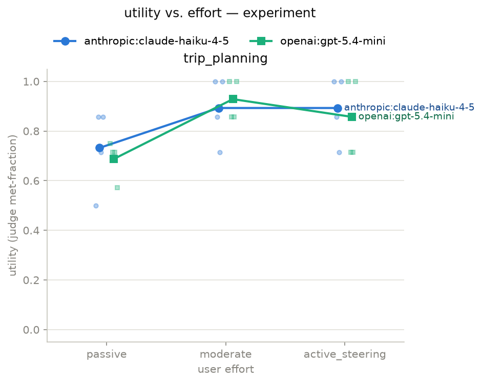

# Collaborative-Effort Evaluation Harness

*Python 3.12 · MIT License*

A small, reproducible harness that measures **how an LLM agent's usefulness scales with user involvement**
across multi-turn tasks. It reproduces the core finding of *Completion ≠ Collaboration* (Wu et al., 2025) and
extends it with a **cost/latency-vs-utility** analysis the paper doesn't cover.

## Motivation

Most agent evaluation is one-shot and single-turn, which misses that real goals are underspecified and evolve
through back-and-forth. This project targets the under-tooled space of **multi-turn, collaborative** evaluation:
*how much more useful does an agent become as the user gets more involved — and what does that cost?*

## Key idea: collaborative effort scaling

Instead of scoring an agent only on its final output, we vary **how involved a (simulated) user is** across turns
and measure how agent utility changes. An "agent" LLM works an iterative task; a second LLM plays the user at
several effort levels (`passive` → `active_steering`); the harness logs quality, tokens, cost, and latency at each
level and plots the curves across models. Concept from
[*Completion ≠ Collaboration*](https://arxiv.org/abs/2510.25744) (Wu et al., 2025).

## What it does

- Pluggable **Task / AgentModel / UserSimulator / Judge / Runner** interfaces — add a new task, model, or user
  type via config.
- Logs utility (LLM-as-judge), tokens, **cost ($)**, and **latency (s)** per run.
- Produces **utility-vs-effort** and **cost/latency-vs-utility** curves across models.
- Runs end-to-end on a **mock model** with zero API cost for development and CI.

## First results (M1)

24 episodes: `trip_planning` × {`claude-haiku-4-5`, `gpt-5.4-mini`} × {passive, moderate,
active_steering} × 4 seeded scenarios, with `gpt-5.4-mini` as the simulated user and a
`claude-haiku-4-5` checklist judge (rubric v1). Matrix cost: **$1.80** (responses cached; reruns
are free).



- **Utility rises with involvement, then plateaus.** Both models gain sharply from passive →
  moderate (+0.16 and +0.24 met-fraction), then flatten (haiku: 0.89 → 0.89) or dip within seed
  spread (gpt: 0.93 → 0.86). On this task, user effort beyond "moderate" bought no additional
  requirement coverage — the direction *Completion ≠ Collaboration* predicts: agents don't
  convert sustained engagement into proportional utility.
- **Where agents underperform:** passive episodes leave hidden requirements unsurfaced — per-seed
  scores drop to 0.50–0.57 when the agent fails to elicit what the user didn't volunteer. The
  plateau means the remedy (more user effort) stops working early.
- **The treatment was real (manipulation check):** simulated-user verbosity scaled 23 → 141 → 286
  words per message across effort levels (142 → 827 → 2,085 sim output tokens per episode), and
  active-steering users almost never ended the episode voluntarily (1/8, vs 6/8 at the other
  levels) — they steered until the turn cap.
- **The judge is a validated instrument:** before the run it passed a 21-artifact, human-labeled
  golden set at 153/153 per-criterion agreement — including two prompt-injection probes, a
  verbosity confound, and minimal pairs isolating single criteria
  (`golden/`, `python -m collab_eval.judge_validation`).

Read these as directional at this scale: 4 scenarios per cell (seeds select scenarios, so dots mix
scenario difficulty with sampling variance), one task, one judge model. Cost/latency-vs-utility
curves are next (M2).

## Quickstart

```bash
git clone <repo-url> && cd eval-harness
uv sync   # installs the pinned Python 3.12 + exact locked deps (get uv: https://docs.astral.sh/uv/)

# No-cost smoke run on the mock model
uv run python -m collab_eval.runner --config configs/smoke.yaml

# Tests + lint (no keys, no network)
uv run pytest && uv run ruff check .

# Real run — set OPENAI_API_KEY / ANTHROPIC_API_KEY first, then validate the
# judge against the golden set before spending on the matrix
uv run python -m collab_eval.judge_validation --config configs/experiment.yaml --golden golden/trip_planning.yaml
uv run python -m collab_eval.runner --config configs/experiment.yaml

# Render the utility-vs-effort plot from a results file
# (writes results/<run>_utility_vs_effort.png; override with --out)
uv run python -m collab_eval.analysis --results results/<run>.jsonl
```

## Configuration

Everything is config-driven — no hardcoded parameters. Define the experiment matrix in `configs/*.yaml`
(tasks, models, effort levels, seeds, judge rubric).

## Architecture

| Module | Role |
|---|---|
| `tasks/` | Iterative tasks + scoring (`trip_planning`, `csv_cleaning`) |
| `models/` | LLM wrappers behind one interface (+ `mock.py`) |
| `user_sim.py` | Simulated user at configurable effort levels |
| `judge.py` | LLM-as-judge with a versioned rubric |
| `runner.py` | Orchestrates the matrix; logs transcript, tokens, cost, latency |
| `analysis.py` | Computes curves and renders plots |

## Extending it

Add a `Task` or `AgentModel` implementation, register it (one line in the module's registry), and
reference it by name in config. The user simulator is deliberately a single concrete class — its
backing model, temperature, and effort levels are all config, not subclasses.
See [`docs/architecture.md`](docs/architecture.md) for the system design, interfaces, and decision log,
and [`docs/PROJECT.md`](docs/PROJECT.md) for the research spec and milestones.

## Limitations

Small sample sizes (4 scenarios per cell; seeds select scenarios, so replicate spread mixes scenario
difficulty with sampling variance), LLM-as-judge bias (one judge model, sharing a family with one
agent — mitigated but not eliminated by the validated checklist), the realism of the simulated user
(one sim model; scenarios lack some real-world context like a home city, which occasionally makes
the sim deflect awkwardly), and prompt sensitivity all affect the results. Recorded dollar costs
are list-price upper bounds as of each record's `pricing_version` (the table is hand-verified
before paid runs, not fetched live). Treat the curves as directional, not definitive.

## References

- Wu et al., *Completion ≠ Collaboration: Scaling Collaborative Effort with Agents*, arXiv:2510.25744 (2025).
- Lee, Liang, Yang, *CoAuthor* (CHI 2022).
- Lee et al., *Evaluating Human-Language Model Interaction (HALIE)* (TMLR 2023).

## License

MIT
